# MediAgent

An end-to-end LLM-powered multi-agent system for intelligent hospital appointment scheduling. Patients interact through a conversational chatbox that guides them through symptom collection, then routes them to the right doctor — with persistent history so the system remembers past consultations.

---

## How It Works

```
Patient opens chatbox
        ↓
[Chat Guide Agent]  →  Follow-up questions (duration, severity, associated symptoms)
        ↓
Patient confirms booking
        ↓
[Agent 1: Symptom Classifier]    →  Department + Urgency
        ↓
[Agent 2: Appointment Retriever] →  Doctor + Time Slot
        ↓
[Agent 3: Response Generator]    →  Confirmation + Pre-visit Instructions
        ↓
[Agent 4: Causes Generator]      →  Possible Causes (RAG-enhanced)
```

Five agents work in sequence. The Chat Guide collects structured information through conversation before handing off to the four-agent booking pipeline. All results stream back to the user in real time — each step is visible as it completes.

### Example Conversation

```
🤖  Hello! Please describe your symptoms.

👤  I've been coughing a lot lately.

🤖  How long have you had this symptom?
    [Less than 1 day]  [1–3 days]  [4–7 days]  [More than a week]

👤  4–7 days

🤖  How would you rate the severity?
    [Mild]  [Moderate]  [Severe]  [Extreme]

👤  Moderate

🤖  Based on your persistent moderate cough over the past week, I'd recommend
    seeing a doctor. Would you like me to book an appointment?
    [Book Appointment]  [Not now]

👤  Book Appointment

🤖  Step 1/4 — Department: Pulmonology | Urgency: Routine
    Step 2/4 — Doctor: Dr. Li Fang | Slot: Tuesday at 10:00
    Step 3/4 — Generating medical advice...
    Step 4/4 — Analyzing possible causes...

    Your appointment with Dr. Li Fang in Pulmonology has been confirmed
    for Tuesday at 10:00. Avoid smoking and stay hydrated before your visit.

    Possible causes:
    1. Acute Bronchitis — ...
    2. Upper Respiratory Infection — ...
```

> When urgency is `Emergency`, the chat displays a red alert to call 911 immediately.

---

## Architecture

```mermaid
flowchart TD
    User(["👤 Patient\n(Browser)"])
    FE["Streamlit Frontend\napp.py"]
    Auth["Auth Layer\nJWT · Google OAuth 2.0"]
    API["FastAPI Backend\napi/v1/router.py"]

    CG["Chat Guide Agent\nagents/chat_guide/agent.py\n──────────────────────\ngenerate_questions()  1 LLM call\ngenerate_summary()    1 LLM call"]

    ORC["LangGraph Orchestrator\norchestrator/graph.py\nMemorySaver · thread_id"]

    A1["Agent 1 — Symptom Classifier\n──────────────────────\nLLaMA-3.2-3B + QLoRA\nAWS SageMaker\n→ Department + Urgency"]
    A2["Agent 2 — Appointment Retriever\n──────────────────────\nDeterministic logic\nAWS DynamoDB\n→ Doctor + Time Slot"]
    A3["Agent 3 — Response Generator\n──────────────────────\nLLaMA-3.2-3B + QLoRA\nAWS SageMaker\n→ Confirmation + Instructions\n→ First Aid (Urgent / Emergency)"]
    A4["Agent 4 — Causes Generator\n──────────────────────\nDeepSeek Chat API\n(OpenAI gpt-4o-mini fallback)\n→ 3–5 Possible Causes + refs"]

    RAG["RAG Knowledge Base\n──────────────────────\nChromaDB (local persistent)\nBAAI/bge-large-en-v1.5\n1,015 MedlinePlus articles"]

    DDB["AWS DynamoDB\n──────────────────────\nDoctorSchedule\nmedi-agent-appointments\nmedi-agent-patient-profiles"]

    QA["Medical Q&A\n/qa endpoint"]
    DRUG["Drug Lookup\n/drug endpoint\nOpenFDA API → RAG fallback"]
    EXT["External APIs\n──────────────────────\nDeepSeek Chat\nOpenAI gpt-4o-mini\nOpenFDA (no key)"]

    User --> FE
    FE <-->|"HTTP / SSE streaming"| Auth
    Auth --> API
    API -->|"POST /chat/questions\nPOST /chat/summary"| CG
    API -->|"POST /query/stream\nPOST /query"| ORC
    API --> QA
    API --> DRUG

    CG -->|"DeepSeek / OpenAI"| EXT

    ORC --> A1
    A1 --> A2
    A2 --> A3
    A3 --> A4
    A4 -->|"done"| ORC

    A1 <-->|"SageMaker invoke"| EXT
    A3 <-->|"SageMaker invoke"| EXT
    A4 <-->|"DeepSeek API"| EXT

    A2 <-->|"Query by department"| DDB
    API <-->|"Appointments · Profiles"| DDB

    A3 <-->|"top-2 docs"| RAG
    A4 <-->|"top-2 docs"| RAG
    QA <-->|"top-4 docs"| RAG
    DRUG <-->|"fallback"| RAG

    style User fill:#4A90D9,color:#fff
    style ORC fill:#7B68EE,color:#fff
    style RAG fill:#2E8B57,color:#fff
    style DDB fill:#FF8C00,color:#fff
    style EXT fill:#DC143C,color:#fff
```



---

## Agents

### Chat Guide Agent

| | |
|---|---|
| **Purpose** | Conversational intake — collects structured symptom information before booking |
| **Step 1** | One LLM call generates 3 follow-up questions with multiple-choice options |
| **Step 2** | One LLM call produces a warm summary and booking confirmation prompt |
| **Cost** | 2 LLM API calls total per session (DeepSeek primary / OpenAI fallback) |
| **Fallback** | Generic questions if LLM is unavailable |

---

### Agent 1 — Symptom Classifier

| | |
|---|---|
| **Inference** | AWS SageMaker endpoint (`medi-agent-classifier`) |
| **Model** | LLaMA-3.2-3B-Instruct + QLoRA adapter |
| **Input** | Patient symptom description + conversation history (up to last 5 consultations) |
| **Output** | Department + Urgency (`Routine` / `Urgent` / `Emergency`) |
| **Training Data** | 15,830 records from Kaggle Disease Symptom Prediction dataset |
| **GPU** | Tesla T4, 3 epochs |
| **Accuracy** | 96.5% overall · 99.7% department · 99.4% Emergency recall |

**Supported departments:** Cardiology, Neurology, Dermatology, Gastroenterology, Endocrinology, Pulmonology, Infectious Disease, Orthopedics, Urology, General Medicine

---

### Agent 2 — Appointment Retriever

| | |
|---|---|
| **Inference** | Deterministic (no ML) |
| **Input** | Department name |
| **Output** | Doctor name + earliest available time slot |
| **Backend** | AWS DynamoDB (`DoctorSchedule` table, `us-west-2`) |
| **Data** | 410 appointment slots across 30+ doctors, Monday–Friday |

---

### Agent 3 — Response Generator

| | |
|---|---|
| **Inference** | AWS SageMaker endpoint (`medi-agent-generator`) |
| **Model** | LLaMA-3.2-3B-Instruct + QLoRA adapter |
| **Input** | Patient text, department, doctor, time slot, urgency, age, gender, patient profile |
| **Output** | Appointment confirmation + pre-visit instructions + first-aid advice |
| **Training Data** | 16,604 records from HuggingFace AI Medical Chatbot dataset |
| **GPU** | NVIDIA A100, 2 epochs |
| **Format Compliance** | 100% on evaluation set |

> `Emergency` urgency is normalised to `Urgent` before calling Agent 3, as the model was trained on `Routine` / `Urgent` only.

---

### Agent 4 — Causes Generator (RAG-enhanced)

| | |
|---|---|
| **Inference** | DeepSeek API (primary) / OpenAI GPT-4o-mini (fallback) |
| **Input** | Patient text, department, age, gender |
| **Output** | 3–5 possible causes, each with a one-sentence reason and MedlinePlus reference |
| **RAG** | Retrieves top-4 relevant MedlinePlus documents via ChromaDB semantic search |
| **Knowledge Base** | 1,015 NIH MedlinePlus health topics |

---

## Frontend Features

| Tab | Description |
|---|---|
| **Symptom Query** | Conversational chatbox — guides patient through symptom collection, then streams the full booking pipeline step by step |
| **Medical Q&A** | Ask any medical question — practical advice on relief, prevention, and reducing recurrence, based on MedlinePlus |
| **Drug Lookup** | Enter a drug name — returns indications, dosage, warnings, and side effects from FDA Drug Label database (MedlinePlus RAG fallback) |

**Persistent history:** For logged-in users, the system automatically loads the last 5 consultations from DynamoDB and passes them as context to each new query — so follow-up questions are always answered with full history in mind.

**Patient profile:** Logged-in users can save blood type, allergies, height, and weight. This data is automatically included in every pipeline call.

**Emergency alert:** When urgency = `Emergency`, a red banner in the chat prompts the user to call 911 immediately.

---

## Project Structure

```
medi-agent/
├── agents/
│   ├── chat_guide/
│   │   └── agent.py                    # Chat Guide — question generation & summary
│   ├── symptom_classifier/agent.py     # Agent 1 — SageMaker
│   ├── appointment_retriever/agent.py  # Agent 2 — DynamoDB
│   ├── response_generator/agent.py     # Agent 3 — SageMaker
│   ├── causes_generator/agent.py       # Agent 4 — DeepSeek + RAG
│   └── rag/
│       ├── retriever.py                # ChromaDB semantic search
│       ├── qa.py                       # RAG-powered Q&A and drug lookup
│       └── ingest.py                   # PDF ingestion for knowledge base
│
├── orchestrator/
│   └── graph.py                        # LangGraph pipeline with MemorySaver
│
├── api/
│   └── v1/
│       ├── router.py                   # All API endpoints
│       └── auth.py                     # JWT + Google OAuth
│
├── auth/
│   └── dependencies.py                 # JWT validation
│
├── scripts/
│   ├── build_rag_index.py              # Parse MedlinePlus XML → ChromaDB
│   ├── deploy_sagemaker.py
│   ├── merge_adapter.py
│   └── setup_infra.sh
│
├── data/
│   ├── raw/                            # Raw datasets (not tracked)
│   ├── processed/                      # Processed data & adapters (not tracked)
│   └── chroma_db/                      # Vector index (not tracked, rebuild locally)
│
├── colab/
│   ├── train_symptom_classifier.ipynb
│   ├── train_response_generator.ipynb
│   ├── eval_symptom_classifier.ipynb
│   └── eval_response_generator.ipynb
│
├── tests/
│
├── app.py                              # Streamlit frontend
├── main.py                             # FastAPI entry point
├── schemas.py                          # Pydantic models + AgentState
├── Dockerfile
└── requirements.txt
```

---

## Setup

### 1. Install Dependencies

```bash
python -m venv venv && source venv/bin/activate
pip install -r requirements.txt
```

### 2. Configure Environment

Create a `.env` file in the project root:

```
AWS_ACCESS_KEY_ID=your_key
AWS_SECRET_ACCESS_KEY=your_secret
AWS_REGION=us-west-2

AGENT1_ENDPOINT_NAME=medi-agent-classifier
AGENT3_ENDPOINT_NAME=medi-agent-generator
DYNAMODB_TABLE_NAME=DoctorSchedule
APPOINTMENTS_TABLE=medi-agent-appointments
PROFILES_TABLE=medi-agent-patient-profiles

JWT_SECRET=your_jwt_secret

GOOGLE_CLIENT_ID=your_google_client_id
GOOGLE_CLIENT_SECRET=your_google_client_secret
GOOGLE_REDIRECT_URI=http://localhost:8000/api/v1/auth/google/callback
FRONTEND_URL=http://localhost:8501

DEEPSEEK_API_KEY=your_deepseek_key
OPENAI_API_KEY=your_openai_key
```

### 3. Build the RAG Index

Download the MedlinePlus XML from [medlineplus.gov](https://medlineplus.gov/xml.html) and place it in `data/`, then run:

```bash
python scripts/build_rag_index.py
```

This parses 1,015 English health topics and builds a persistent ChromaDB index at `data/chroma_db/`. Only needs to run once.

### 4. Run Locally

```bash
# Backend
uvicorn main:app --host 0.0.0.0 --port 8000 --reload

# Frontend (separate terminal)
streamlit run app.py
```

Health check: `curl http://localhost:8000/api/v1/health`

---

## API

| Method | Endpoint | Auth | Description |
|---|---|---|---|
| `GET` | `/api/v1/health` | None | Health check |
| `POST` | `/api/v1/auth/register` | None | Register new user |
| `POST` | `/api/v1/auth/login` | None | Login, returns JWT |
| `GET` | `/api/v1/auth/google` | None | Google OAuth login |
| `POST` | `/api/v1/chat/questions` | None | Generate follow-up questions |
| `POST` | `/api/v1/chat/summary` | None | Generate symptom summary |
| `POST` | `/api/v1/query/stream` | Optional JWT | Run full pipeline (SSE streaming) |
| `POST` | `/api/v1/query` | Optional JWT | Run full pipeline (synchronous) |
| `POST` | `/api/v1/qa` | None | Medical Q&A (RAG) |
| `POST` | `/api/v1/drug` | None | Drug lookup (FDA → RAG fallback) |
| `GET` | `/api/v1/appointments` | Required JWT | Appointment history |
| `DELETE` | `/api/v1/appointments/{ts}` | Required JWT | Cancel appointment |
| `GET` | `/api/v1/profile` | Required JWT | Get patient profile |
| `PUT` | `/api/v1/profile` | Required JWT | Update patient profile |

---

## Persistent Conversation History

For logged-in users, every new query automatically loads the last 5 appointments from DynamoDB and injects them as conversation context:

```
Previous consultations:
  Turn 1: "headache and fever" → General Medicine (Routine)
  Turn 2: "lower back pain" → Orthopedics (Urgent)

Current concern: I've been coughing for a week
```

This means the system accumulates knowledge about each patient across sessions — even after logout or server restart.

---

## RAG Knowledge Base

| | |
|---|---|
| **Source** | NIH MedlinePlus (`mplus_topics_*.xml`) |
| **Coverage** | 1,015 English health topics across 30+ medical categories |
| **Vector Store** | ChromaDB (local persistent) |
| **Embedding Model** | `BAAI/bge-large-en-v1.5` (local, via sentence-transformers) |
| **Similarity** | Cosine |
| **Used by** | Agent 4 (possible causes), `/qa`, `/drug` endpoints |

Top covered categories: Infections (126), Brain & Nerves (102), Cardiology (93), Digestive System (79), Bones & Muscles (78), Oncology (66), Skin (63).

---

## CI/CD

Every push to `main` triggers the GitHub Actions pipeline:

```
push to main → Unit Tests (pytest) → Docker build → ECR push → ECS Fargate deploy
```

**Required GitHub Secrets:** `AWS_ACCESS_KEY_ID`, `AWS_SECRET_ACCESS_KEY`

---

## Training

Both LLaMA agents use **QLoRA** (4-bit quantization + Low-Rank Adaptation):

| | Agent 1 (Classifier) | Agent 3 (Generator) |
|---|---|---|
| Base Model | LLaMA-3.2-3B-Instruct | LLaMA-3.2-3B-Instruct |
| LoRA Rank | 8 | 16 |
| LoRA Alpha | 16 | 32 |
| Trainable Params | 2.29M (0.07%) | 24.31M (0.75%) |
| Quantization | 4-bit NF4, float16 | 4-bit NF4, bfloat16 |
| Epochs | 3 | 2 |
| GPU | Tesla T4 | NVIDIA A100 |

---

## Tech Stack

| Layer | Technology |
|---|---|
| LLM Fine-tuning | `transformers`, `peft`, `trl`, `bitsandbytes` |
| Orchestration | `langgraph` |
| API | `fastapi`, `uvicorn` |
| Frontend | `streamlit` |
| Auth | JWT (`python-jose`, `passlib`), Google OAuth 2.0 |
| Database | AWS DynamoDB (`boto3`) |
| Inference | AWS SageMaker (Agents 1 & 3), DeepSeek API / OpenAI (Agent 4 + Chat Guide) |
| RAG | ChromaDB, `BAAI/bge-large-en-v1.5`, MedlinePlus |
| Deployment | Docker, Amazon ECR, ECS Fargate |
| CI/CD | GitHub Actions |
| Testing | `pytest` |
| Training Platform | Google Colab (T4 / A100) |
